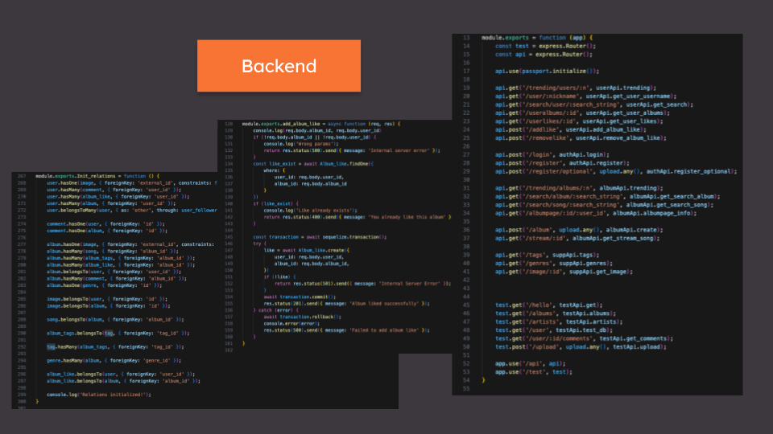
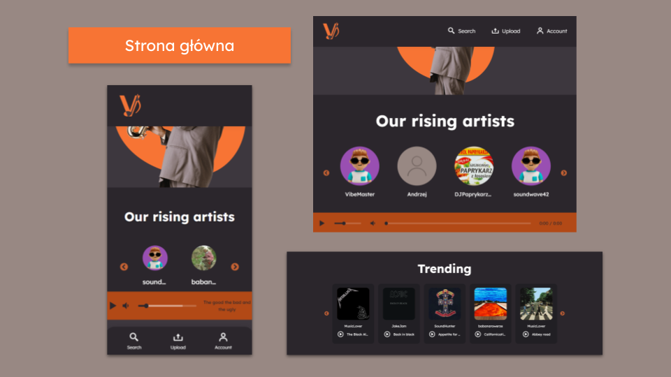

VibeStream
============

VibeStream is a **free social music-streaming network** where users can follow artists, build a music library and share their own works.


Features include:
* A sleek, modern interface,
* Fast and easy deployment,
* Little necessary configuration,
* Secure JSON Web Token authentication,
* Ability to quickly share a music album,
* An extensive search engine,
* A simple way to find and contact like-minded artists.

Setup 
---------------------------

Docker is necessary to run the software, so make sure you have it installed.

1. Clone the project:
`$ git clone https://github.com/Jakub-S-K/VibeStream.git`

2. Navigate into the project directory:
`$ cd VibeStream`

3. Create a `.env` file.
Example .env file:

```
	#------ DB -------
	DB_ROOT_PASSWORD=rootpassword
	DB_USER=username
	DB_USER_PASSWORD=password
	DB_NAME=vibestream
	
	#---- BACKEND ----
	BACKEND_PORT=3001
	BACKEND_PORT_DOCKER=3001
	JWT_SECRET=topsecretpassword
	
	#---- FRONTEND ----
	FRONTEND_PORT=3000
```

4. Start the Docker containers:
`$ docker compose up --build`

Your server is now running, and you can access it by opening <http://localhost:3000/> in your web browser. The database's interface defaults to port 8081.

Screenshots
-------------




The tech stack
--------------
* VibeStream currently uses React with Vite to dynamically serve the web client.
* On the backend, an extensive home-built API has been built utilizing Node.js and Express.js.
* MariaDB is used as the database software.
